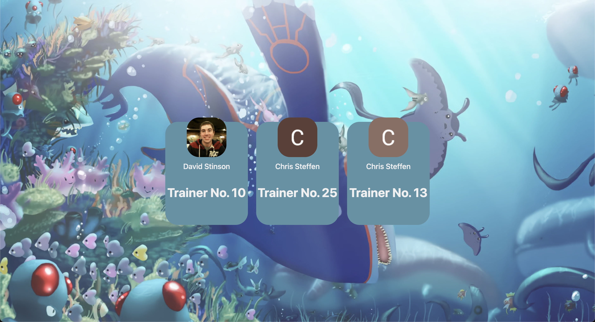
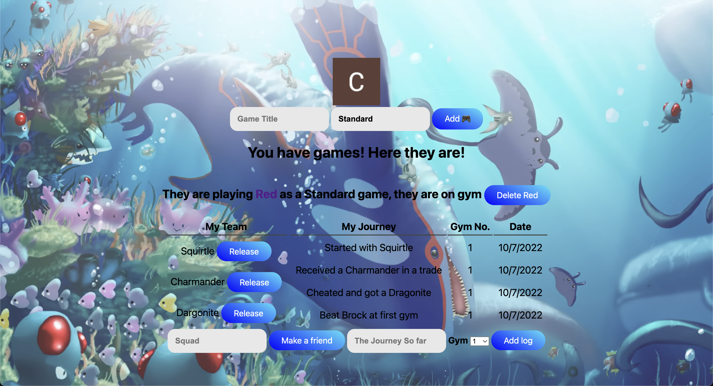

# Pokemon Team Tracker

## Objective:
### - My goal was to make a place for people to share their journey in one of the most popular gaming franchises in the world.
---

## Find my website [here](https://pokemon-team-tracker.fly.dev/profiles)

---

## Motivation:

### - Like a lot of people I am a fan of the pokemon franchise. One of the best parts of the game is building a team of pokemon that you love. As you progress through the game and level them up you grow attached to them. Everyone picks out their favorites that are a must on any team, while some like to make it more challenging. One way to do this is by attempting a nuzlocke, a nuzlocke is a specific set of self imposed rules to make the game more challenging. The main two rules are you can only catch the first pokemon you encounter on every route, and if a pokemon faints you cannot revive them. Playing a pokemon nuzlocke is becoming more popular with streamers, and after watching one I thought it would be cool to have a place where people who missed a stream could get updates on what they missed and what the team is looking like. With that in mind I hope to add a fainted list to the tracker so everyone can remember their fallen comrades at the end of their journey.

---
## Planning Materials

### All my planning materials can be found on [trello](https://trello.com/b/kA5jE6OW/pokemon-tracker)
---

## Live Tracker:

---
## CSS Styling Credits

- From uiverse.io by @niat786 
- From uiverse.io by @Yaseen549 
- From uiverse.io by @gagan-gv

---

## Technology Implemented:

- Javascript
- CSS
- Html
- Git
- Mongo DB
- Google OAuth

---

## Minimum Viable Product:

- As a user, I want to login.
- As a user, I want to logout.
- As a user, I want to be able to delete games from my profile.
- As a user, I want to be able to add game to my profile.
- As a user, I want to be able to pick what style of game I am playing.
- As a user, I want to be able to keep a log of my game as a reminder of what happened previously.
- As a user, I want to be able to set what gym I am up to
- As a user, I want to be able to view other profiles and what games they are playing.

---

## Stretch Goals:

- As a user, I want to be able to combine different game styles.
- As a user, I want to be able to add fainted pokemon to and R.I.P list for nuzlocke styled games.
- As a user, I want to be able to edit my team of pokemon.

